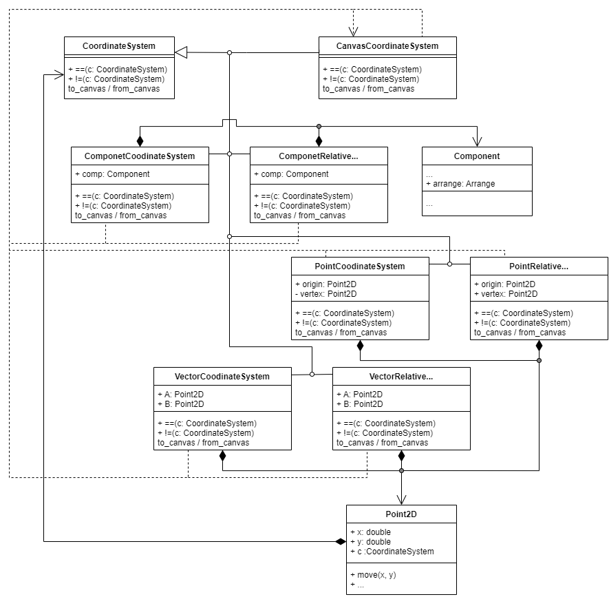
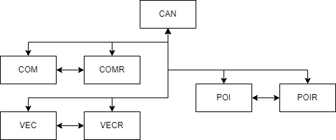

# 几种坐标系定义与坐标系转换

## 坐标系类型

|坐标系|说明|ID|
|:-|:-|:-:|
|空坐标系|空|NULL|
|画布坐标系|画布的绝对坐标系|CAN|
|组件坐标系|以组件布局中心为原点的绝对坐标系|COM|
|组件相对坐标系|以图形中心为原点，以图形矩形区域长宽为$[-1,1]$的相对坐标系|COMR|
|点坐标系|以一点$a$作为原点的绝对坐标系|POI|
|点相对坐标系|以一点$a$作为原点，另一点$b$作为$(1,1)$的相对坐标系|POIR|
|向量坐标系|以一点$a$作为原点，$\overrightarrow{ab}$作为x轴的绝对坐标系|VEC|
|向量相对坐标系|以一点$a$作为原点，另一点$b$作为$(1,0)$的相对坐标系|VECR|

### 画布坐标系

表示各组件（包括图形和文字）在画布上的绝对位置。这里的画布并非指<canvas\>组件，而是指一个虚拟存在的画布。组件通过布局被映射到画布，画布容纳了一个流程图中全部的组件。

画布坐标系没有参照物，是全局的绝对坐标系。**原点**、**轴**与**刻度**为全局的参考单位。（类似于世界坐标系）

### 组件坐标系

组件自身使用的坐标系。组件通过布局(Arrange)被映射到画布中（也可以反向映射）。其**原点**是布局中心，**轴**取决于布局旋转，**刻度**同画布坐标系。

组件坐标系的原点，就是布局的中心，也是旋转中心。并且组件在画布中的坐标，就是布局中心在画布中的坐标。它们的结果是一致的，但是范畴不同。

1. 组件坐标系下：外接矩形中心、组件坐标系原点。
2. 画布坐标系：布局中心、旋转中心、画布位置。

#### 更新对布局的影响

- 内部更新（关键点、文字更新）
	
	内部更新的直接更新对象是组件内部的图像或文字。内部更新中布局是间接更新对象，且不涉及旋转，只涉及移动。设布局旋转对应的从组件坐标系到画布坐标系的映射为$M$.
	
	设当前组件坐标系原点为$O=(0,0)$。每次内部更新后，重新计算组件在组件坐标系下的外接矩形，随后得到一个外接矩形中心$O'$。接下来令该中心为新的组件坐标系原点，即所有组件内部的svg整体移动$\overrightarrow{O'O}$。

	布局中心始终与组件坐标系原点重新。因此上述更新使得组件在画布坐标系上来看，改变后仍然整体移动了$M×\overrightarrow{O'O}$。为了消除影响，需要更新布局，将布局移动$M×\overrightarrow{OO'}$。

- 布局更新（旋转、移动）

	- 旋转
		布局中心不变，只是改变组件中各svg到组件svg的线性变换方式。
		
	- 移动
		对布局中心，也就是画布位置简单地进行平移。也就是对两个分量进行数值加减。

#### 组件相对坐标系

一种组件坐标系的变种，**刻度**以组件外接矩形的长宽映射为$[-1,1]$，**原点**与**轴**同组件坐标系。可以以坐标表示比例。

### 点坐标系

相对某点的坐标系，称该点为**原点**(origin)。**轴**与**刻度**同原点所处的坐标系。

#### 点相对坐标系

点坐标系的变种。引入另外一点**顶点**(vertex)，作为该坐标系中的(1,1)，它必须与原点在同一坐标系下。此时可以以坐标表示比例。

### 向量坐标系

以某向量为基准的坐标系。其中起点$A$为**原点**，向量方向$\frac{\overrightarrow{AB}}{|AB|}$为x**轴**，**刻度**取决于向量所在的坐标系。

#### 向量相对坐标系

向量坐标系的变种。其中$B$表示(1,0)。此时可以以坐标表示比例。

### 空坐标系

引入空坐标系表示默认与错误。

## 坐标系转换

每个坐标系提供两种方向的基本转换：转为画布坐标系；从画布坐标系推导。由此可以实现任意坐标系相互转换。

除了各个坐标系与画布坐标系的相互转换外，还提供了绝对坐标系与对应的相对坐标系间的转换。