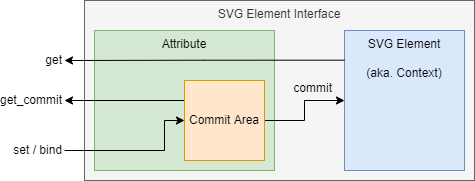

# SVG属性

各种SVG中使用的属性的类型。这些对象被作为SVG元素接口的成员，并被进一步与C++类型适配，同时提供读、写、绑定等操作。

## 属性分类

### 基本类型

非派生的类型，不可再分。

#### 文本选项

一些被Web标准中预制的文本选项。例如："none", "fixed"等。

#### 内容类型

SVG中需要用到的基本属性类型，信息来自：「[mozilla/Web/Content_type](https://developer.mozilla.org/en-US/docs/Web/SVG/Content_type)」。例如："\<number\>", "\<length\>"等。

### 枚举

接受任一有效类型的属性，属性间的关系为析取。例如："none|\<number\>"等。

// TODO

### 元组

需要同时存在的多个类型属性，且区分顺序。与列表不同，元组中包含的属性是多类型的，且数量是一定的。例如："(\<number\>) (a|b)"等。

// TODO

## 通用接口

属性类型间并非派生关系，而是借助template实现泛型。所有的属性都提供相同的接口，只是参数支持的C++类型不同。

属性分为提交区和上下文区。其中提交区属于属性的私有域，存储了待提交的数据（修改后的数据）。进行提交操作后，属性从提交区被提交到上下文（即SVG抽象元素）：

### 读

只能读取被转换后的属性字符串。

#### 从上下文读

`get`：直接通过上下文读取，获取的是提交前的信息。

#### 从提交区读

`get_commit`：从提交区读取，可预览提交后的信息。

### 写

#### 设置值

`set(), operator=()`：直接将某个值转换并复制到提交区。

#### 与函数绑定

`bind(), operator`：提交时运行该函数，返回值被转换并提交。

#### 与指针绑定

`bind(), operator`：提交时指针指向的值被转换并提交。

#### 转换

一些私有接口，用于将特定C++类型转换为可行的属性字符串。

#### 参数泛型

属性默认支持所有C++类型为参数，但是只有特定C++类型的参数可以被正确转换为属性字符串；对于其他C++类型，将重置提交区。

### 提交

将提交区提交至上下文。原理是调用上下文中的getter与setter。